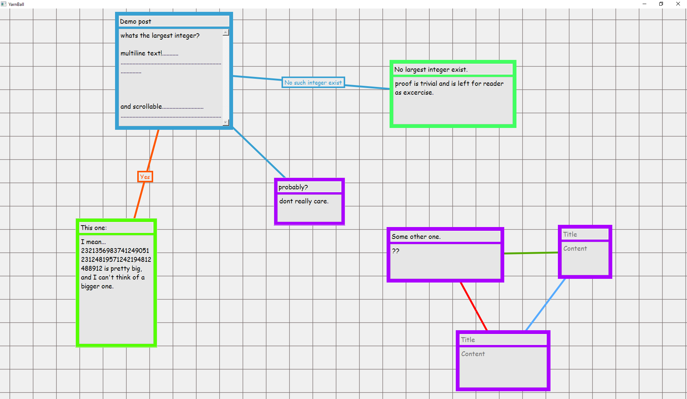

# yarnball
A python program for organizing ideas, planning, brain storming etc.  
All requirements and the program itself are packaged with pyinstaller and can be downloaded ./dist or the Releases section. 



##Controls
- Middle click or left click and drag background to move camera/move background.
- Double left click background to make new post.
- Double left click to edit existing posts.
- Single left click to select post or connection.
- Left click and drag to move post.
- Right click and drag to another post to make connection.
- Ctrl + W or del to remove select connection or post.
- Ctrl + Z to undo deleting a post.
- Ctrl + N to make new file in a new window.
- Ctrl + O to open a file.
- Space bar to open a menu with file controls(save, save as, open, new file).

Save files follows the following format for each post: ``` id|[connection ids]|hexColor|title|content|x|y|sizeX|sizeY  ```
the save file for the image above looks something like this: 
```
0|[1]|#37A0D2|Title|Content|-526|-280|176|175
1|[3]|#ffaa00|Title|Content sada|365|206|300|300
2|[1, 0]|#22ff4e|Title|Content|273|-200|300|300
3|[]|#ff5500|Title|Content|-282|48|300|300
4|[]|#37A0D2|Title|Content|6|-86|300|300
```
The id may be any integer, but must be unique. The connection list should have unique ids that exists. badly formatted save file results exceptions thrown at the moment :v

Also, you can set the program as the default way to open .yarnball files, to open save files more conviniently. 
##Requirements:
PyQt5 for ui, pyinstaller for packaging. 
  
